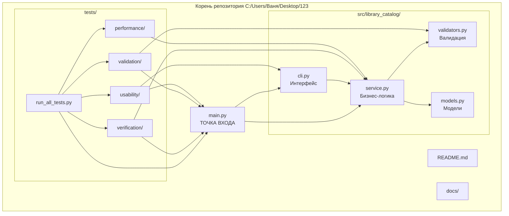
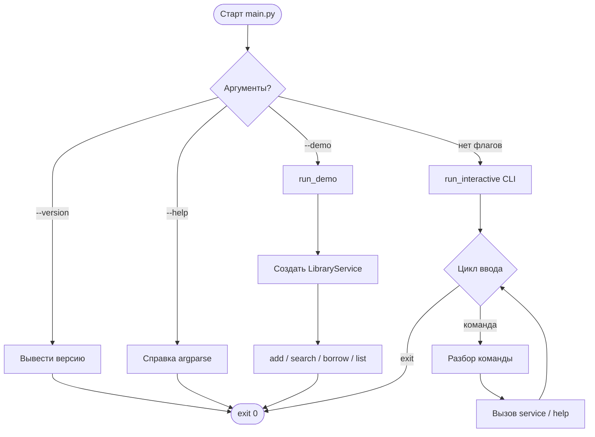
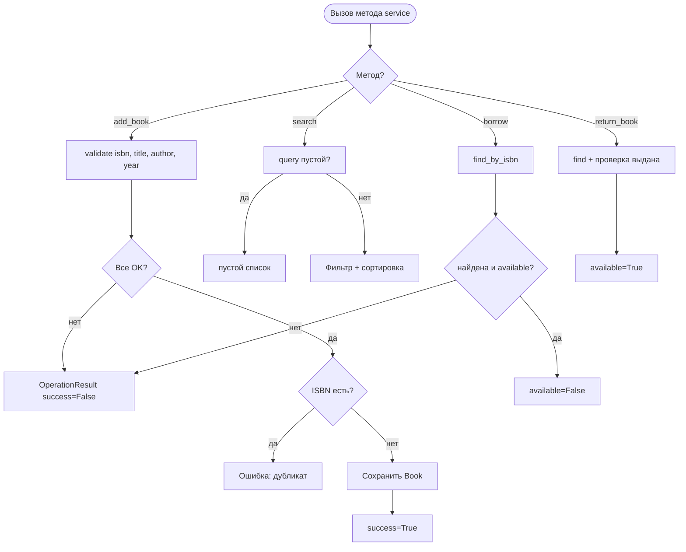
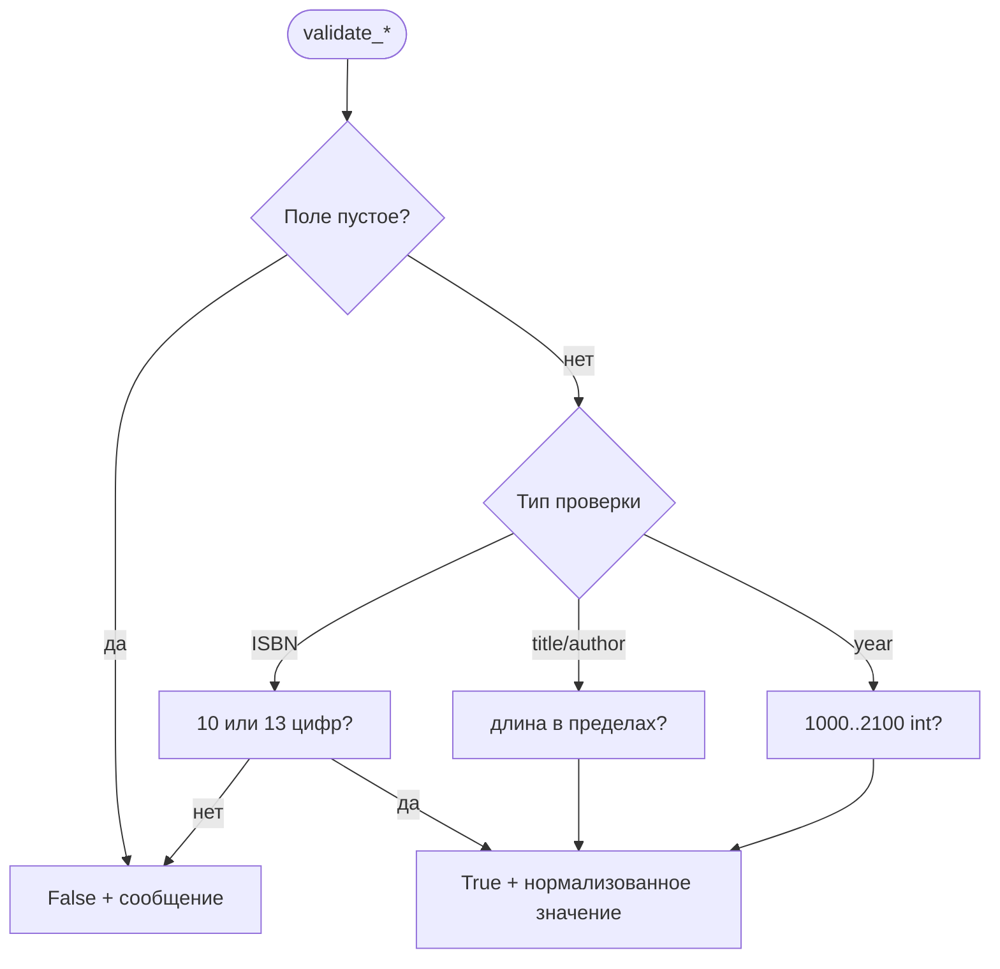
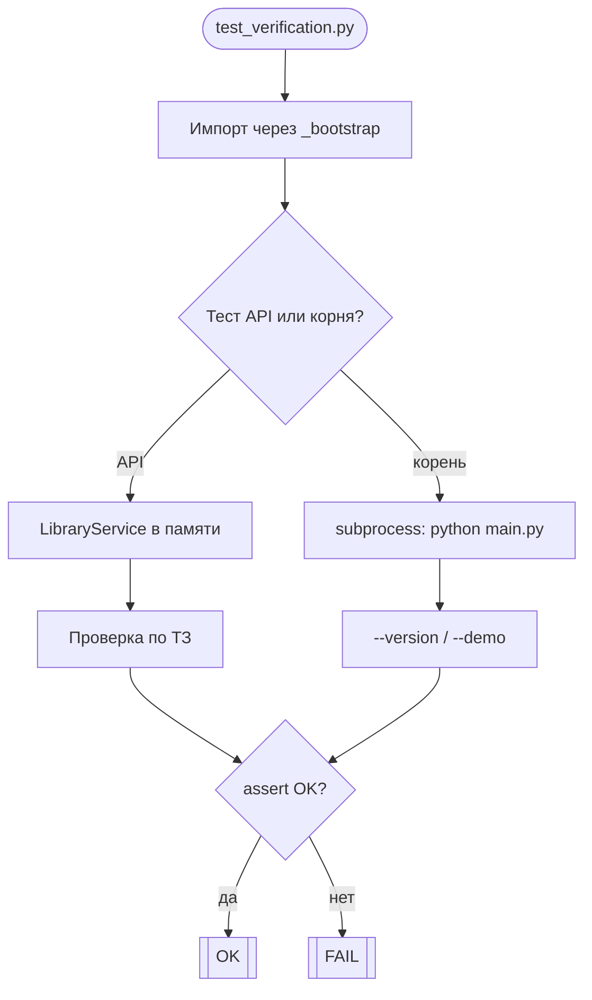
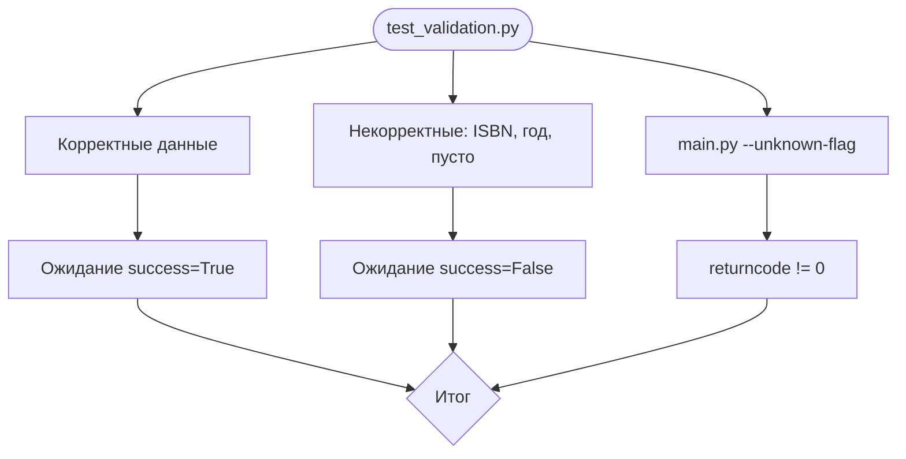
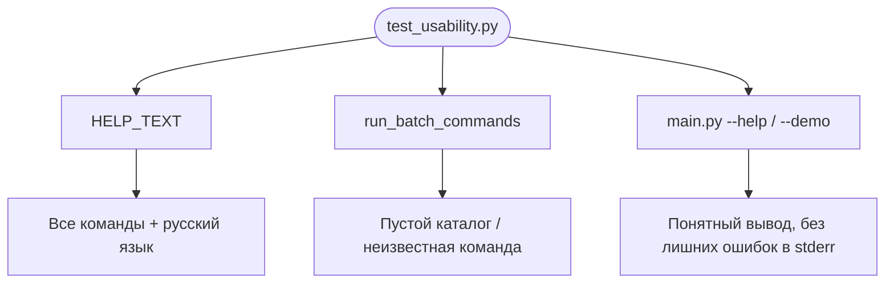
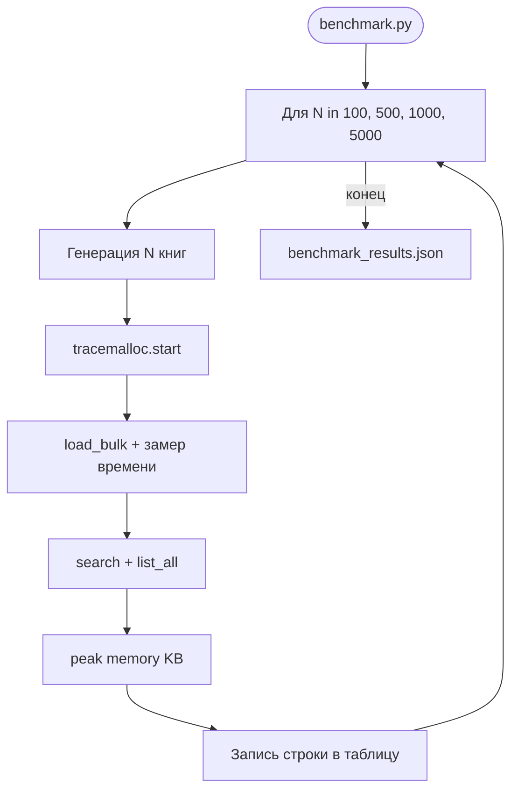
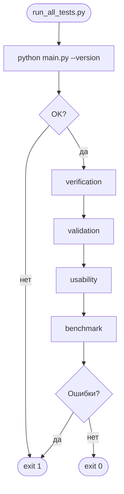

# Блок-схемы проекта «Каталог библиотеки»

## 1. Общая структура Git-проекта

## 2. Блок-схема корня программы (main.py)

## 3. Модуль service.py (бизнес-логика)

## 4. Модуль validators.py

## 5. Подсхема: тест верификации

## 6. Подсхема: тест валидации

## 7. Подсхема: тест юзабилити

## 8. Подсхема: нагрузочный тест

## 9. run_all_tests.py

